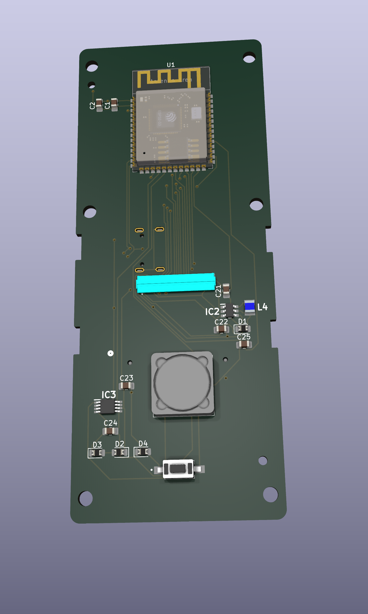
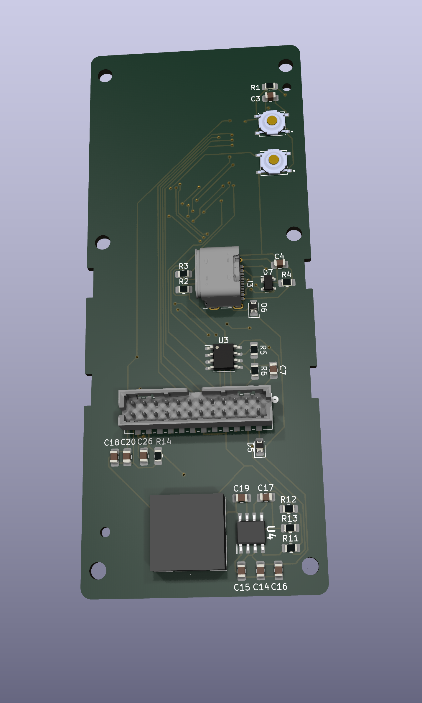

> [!NOTE]
> This board does drive the scooter, but it has some issues. This revision is not recommended.

## Errata ##
- LCD connector is wired in reverse
- There are two 3.3v nets, causing half the board to be unpowered.
- 3.3v is insufficient for the headlight driver
- The headlight driver's current is set too low.
- The headlight driver's inductor physically interferes with LCD
- The data lines to the LCD span two registers, necessitating jumper wires for compatibility with the `TFT_eSPI` library.

## Board Renderings ##

