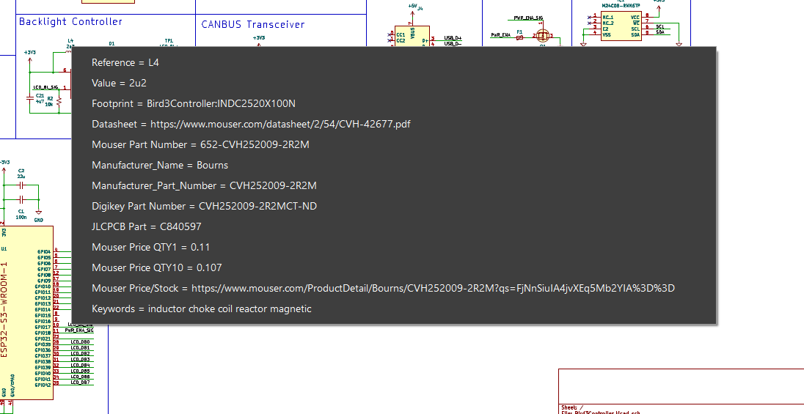

> [!NOTE]
> This design is untested

## Development ##
This was developed in [KiCad 8](https://www.kicad.org/), a FOSS EDA suite. Most or all of the symbols, footprints, and 3D models have been included in the repo to reduce the chance of broken references.

## Ordering Information ##
[JLCPCB](https://jlcpcb.com/) is a good place from which to order a PCB.
- The gerber files are in the [./plots](plots) folder.
- The Bill of Materials is at [./BOM.csv](BOM.csv).

These JLCPCB settings were used for the test order:
| Setting                 | Value                   |
|-------------------------|-------------------------|
| Layers                  | 2                       |
| Dimension               | 43 mm* 108 mm           |
| PCB Thickness           | 1.6                     |
| Impedance Control       | no                      |
| Material Type           | FR4-Standard TG 135-140 |
| Via Covering            | Tented                  |
| Outer Copper Weight     | 1 oz                    |
| Castellated Holes       | no                      |
| Edge Plating            | no                      |
| Remove Order Number     | Specify a location      |
| Board Outline Tolerance | ±0.2mm(Regular)         |

## Fixes from Rev 1 ##
- Corrected slight inaccuracies in mounting hole locations
- Wired the LCD Connector in the correct direction
- Adjusted LCD mounting to add alignment holes and correct mounting cutout width.
- Moved components interfering with LCD mounting
- Replaced headlight circuit with one that steps down directly from 36V.
- Moved components interfering with LCD
- Increased headlight current setting

## Improvements from Rev 1 ##
- Added 22-pin connector (Credits to `Mental_Metalhead` for the pinout)
- Added EEPROM for durable storage ($0.19 BOM, > 4 million writes)
- Added Mosfet to programatically ground the `PWR_ENA` pin rather than tying it permanently to ground
- Added copper pour to reduce EMI

## Errata ##
- LED Headlight circuit doesn't work due to excessive ratio between VIN (~36V) and VOut (3.0V).

## Board Renderings ##

## Bill of Materials ##
An interactive BOM generated by [InteractiveHtmlBOM](https://github.com/openscopeproject/InteractiveHtmlBom) is available at [https://html-preview.github.io/?url=https://github.com/ysoyjcgoxohxoh/Bird3/blob/master/PCB/Bird3Controller_Rev2/bom/ibom.html](https://html-preview.github.io/?url=https://github.com/ysoyjcgoxohxoh/Bird3/blob/master/PCB/Bird3Controller_Rev2/bom/ibom.html)

## PDF Schematic ##
A PDF schematic is available at [Bird3Controller.pdf](Bird3Controller.pdf). When opened in a more advanced viewer such as Acrobat Reader, the components are bookmarked, and both components and nets are clickable as shown in this screenshot, making it easy to open the part's datasheet or Mouser.com listing.

## PNG Schematic ##

