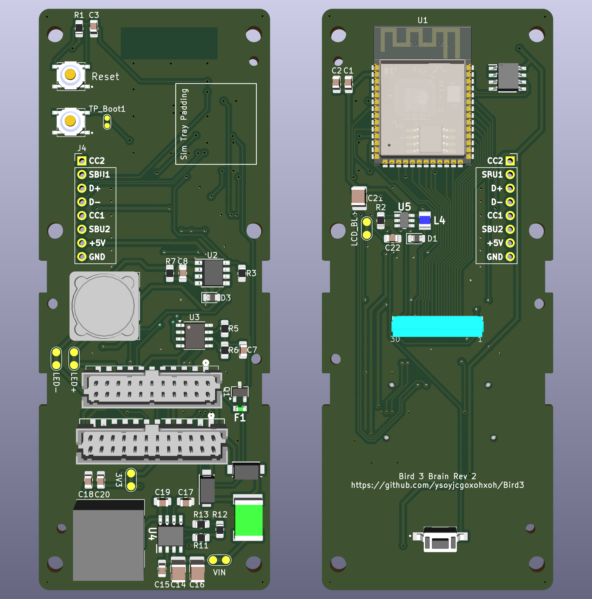

# Bird 3 #

## Introduction ##
This repository attempts to document the specs and operation of the Bird 3 scooter. It provides a PCB design and associated software for a drop-in replacement Bird Brain compatible with the EA00004 and EA00022 brains.

The PCB is designed in KiCad around an ESP32-S3. It is designed to fit into the original enclosure and use the existing LCD, the [TXW154028S0](./Datasheets/TXW154028S0_SPEC.pdf).

More documentation for the scooter is available in the [Wiki](../../wiki).

> [!WARNING]
> This repository is intended for use with legally and ethically acquired scooters only. Not only is stealing scooters a crime, it is also unethical.

## Repository Structure ##
- The `Arduino` directory contains the code to run the scooter.
- The `Datasheets` directory contains datasheets for various components.
- The `PCB` directory contains the PCB design.
  - [Rev 1](./PCB/Bird3Controller_Rev1/Readme.md).
  - [Rev 2](./PCB/Bird3Controller_Rev2/Readme.md).
  - [Rev 3](./PCB/Bird3Controller_Rev3/Readme.md).

## Credits ##
- `Mental_Metalhead` - For lots of back and forth testing the software, providing the 22-pin connector pinout, and for various advice on designing PCBs.
- The folks in the Scooterhacking.org community. (DM me if you wish to be credited directly. You know who you are.)

## Board Renderings - Rev 2 ##

